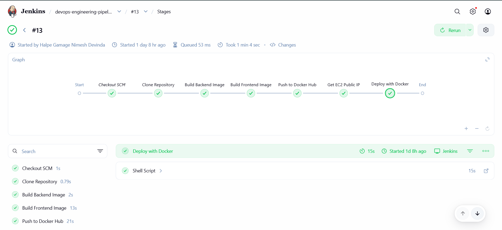
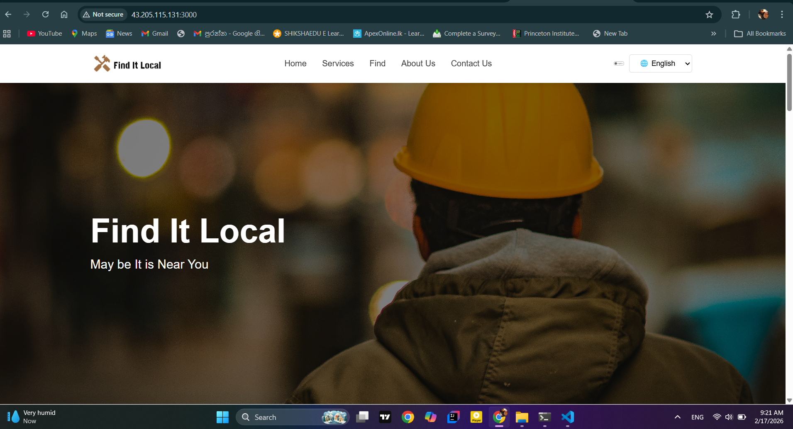

# 🚀 DevOps Engineering Project – CI/CD with Jenkins, Docker & Terraform on AWS

## 📌 Project Overview

This project demonstrates a complete CI/CD pipeline using:

- **Docker** for containerization
- **Jenkins** for Continuous Integration & Deployment
- **Terraform** for Infrastructure as Code
- **AWS EC2** for cloud hosting

The system automatically:

- Builds backend & frontend Docker images
- Pushes images to Docker Hub
- Deploys updated containers to AWS EC2
- Runs full-stack application in production

---

## 🏗 Architecture

### 🔹 Components Used

| Component | Purpose |
|-----------|---------|
| Jenkins | CI/CD automation server |
| Docker | Containerization platform |
| Terraform | Infrastructure provisioning |
| AWS EC2 | Cloud compute instance |
| Docker Hub | Container registry |

### 🛠 Tech Stack

- Node.js (Backend)
- React (Frontend)
- Docker
- Jenkins
- Terraform
- AWS EC2
- Ubuntu 22.04

---

## ⚙️ Infrastructure Setup (Terraform)

Terraform provisions:
- EC2 Instance (Free Tier)
- Security Group (Ports 22, 3000, 5000)
- Docker installation via user_data

### Example Command

```bash
terraform init
terraform apply

```
## Final Output




---
